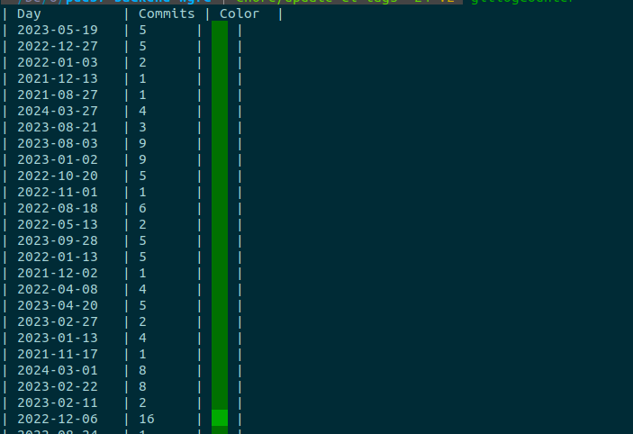

# Git Log Counter

Git Log Counter is a command-line tool written in Go that counts the number of commits for each day in a Git repository and displays the results in a colorized table format.

## Installation

To install Git Log Counter, you can either compile the source code yourself or download the precompiled binary from the releases section.

### Compile from Source

To compile from source, ensure you have Go installed on your system. Then, follow these steps:

1. Clone this repository:

   ```bash
   git clone https://github.com/golesuman/colorize-git-commits.git
   ```

2. Navigate to the repository directory:

   ```bash
   cd colorize-git-commits/src
   ```

3. Compile the source code:

   ```bash
   go build -o ../bin/gitlogcounter
   ```

4. Move the binary to a directory in your PATH, such as `/usr/bin`:

   ```bash
   sudo mv gitlogcounter /usr/bin
   ```

### Download Precompiled Binary

You can download the precompiled binary from the releases section of this repository. Once downloaded, move the binary to a directory in your PATH, such as `/usr/bin`.

## Usage

To use Git Log Counter, simply run the `gitlogcounter` command in your Git repository directory:

```bash
gitlogcounter
```

Git Log Counter will display a colorized table showing the number of commits for each day in the repository.

## License

This project is licensed under the MIT License - see the [LICENSE](LICENSE) file for details.


### Sample Output
